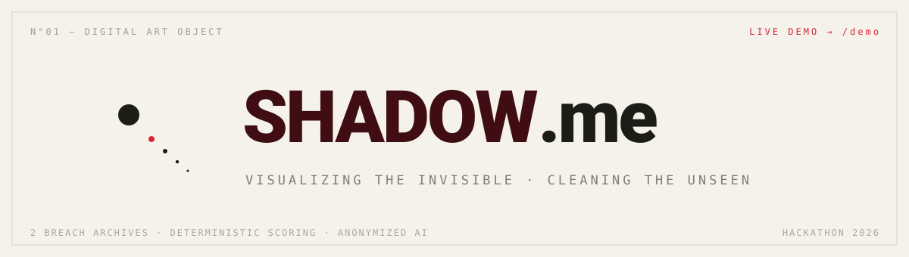
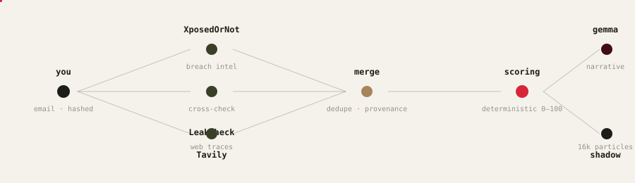

<div align="center">
  
</div>

---

**SHADOW.me** — your email is checked against two independent breach archives and the open web, scored by a deterministic explainable engine, and rendered as a **living particle organism** — your digital shadow — which you can collapse into a single point. Then clean it.

<div align="center">
  
</div>

## why it's real

- **two independent archives** (XposedOrNot + LeakCheck) — a leak confirmed by both gets a provenance bonus. one source alone can't fool the score
- **deterministic scoring** — no AI guessing. every point has a reason shown in the UI: `passwords exposed +30`, `plaintext +25`, `recent breach +14`…
- **AI never decides facts** — Gemma (Ollama Cloud) only narrates anonymized breach metadata
- **verify it yourself**: scan `test@example.com` (burned in hundreds of real breaches), then check it on [xposedornot.com](https://xposedornot.com). same numbers.

## run it

```bash
cp .env.example .env.local   # OLLAMA_API_KEY (free) · TAVILY_API_KEY (optional)
npm install
npm run dev                  # → http://localhost:3000
```

🎬 **demo film** — open [`/demo`](http://localhost:3000/demo) — a 3-minute auto-driven pitch with live scans, cinematic 3D orbit and kinetic typography. sound is added in post.

## privacy

- email is hashed for the in-memory cache (5 min) — **never stored, never logged**
- the model receives **anonymized breach metadata only** — never your email
- all scoring code is client-visible and explainable

## stack

`Next.js 16` · `React 19` · `three.js + R3F` (custom GLSL, 14k particles) · `GSAP + ScrollTrigger` · `Web Audio` (procedural sound, zero files) · `zustand` · `Ollama Cloud (gemma4)` · `Tavily`

---

<div align="center">
<sub>see your shadow. clean it. — hackathon 2026</sub>
</div>
